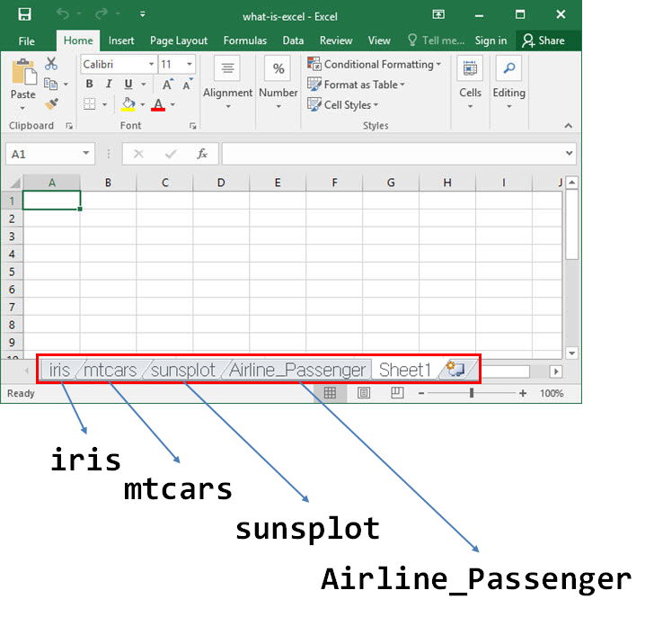
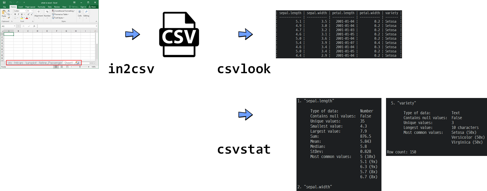
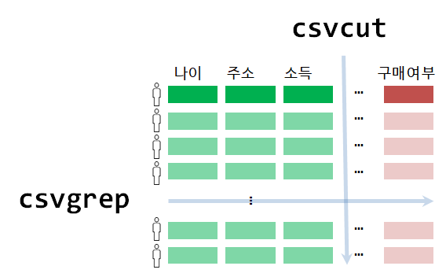

```{r setup, include=FALSE}
knitr::opts_chunk$set(echo = TRUE, message=FALSE, warning=FALSE,
                      comment="", digits = 3, tidy = FALSE, prompt = FALSE, fig.align = 'center')

library(reticulate)
use_condaenv("anaconda3")
# reticulate::repl_python()
```


# 엑셀 `.csv` 데이터 추출 {#cli-toolchain-excel}

가장 많이 사용되는 직사각형 데이터 형태가 엑셀파일이다. 엑셀파일에 담긴 워크쉬트(worksheet) 데이터를 엑셀을 열지 않고 `.csv` 파일로 추출하는 방법을 살펴보자.
먼저 가장 많이 알려진 데이터 사이언스 대표 데이터셋을 엑셀 워크시트에 넣어 엑셀 파일을 구성해 보자.

{#id .class width="100%"}

# `csvkit` 설치 {#cli-toolchain-csvkit}

`csv` 데이터를 쉘에서 CLI로 처리할 때 많이 사용되는 도구는 `csvkit`이다. `wireservice` 회사가 개발하여 github에 공개한 [`csvkit`](https://github.com/wireservice/csvkit)은 `.csv` 파일을 비롯하여 직사각형 표형태(tabular format) 데이터를 처리하는데 적합하다.

파이썬으로 개발되어 `pip install csvkit` 명령어로 설치한다. 이미 설치된 경우 최신 버전은 `pip install --upgrade csvkit` 명령어로 가능하다.

# 엑셀 워크쉬트 추출 {#cli-toolchain-csvkit-worksheet}

`in2csv` 명령어를 사용하여 대상 엑셀 파일을 지정하고 엑셀 파일에 포함된 워크시트를 특정하기 위해서 `--sheet` 선택인자를 명세하여 특정 워크시트만 뽑아내서 이를 `data/` 하위디렉토리 `iris_ws.csv` 파일명으로 저장한다. 
여기서 `>` 리다이렉션 연산자로 엑셀 파일에서 뽑아낸 워크시트를 화면에 뿌리는 대신 파일로 저장시킨다.

```{bash excel-worksheet}
in2csv data/dataset.xlsx --sheet "iris" > data/iris_ws.csv

head data/iris_ws.csv
```

{#id .class width="100%"}

# `.csv` 파일 살펴보기 {#cli-toolchain-csvkit-lookinside}

`csvkit`에 포함된 `csvlook` 명령어는 `.csv` 파일을 마크다운 포맷으로 보기 좋게 화면에 출력시킨다.

```{bash excel-worksheet-lookinside}
head data/iris_ws.csv | csvlook 
```

# `.csv` 기술분석 {#cli-toolchain-csvkit-descriptive}

`csvkit`에 포함된 `csvstat` 명령어를 통해 직사각형 데이터의 변수별 단변량 기술통계량(descriptive statistics)를 뽑아볼 수 있다. 이를 통해 자료형, 결측값을 포함한 기초 통계를 자료유형별로 뽑아볼 수 있다.

```{bash excel-worksheet-lookinside}
csvstat data/iris_ws.csv
```

{#id .class width="100%"}

# 행과 열 필터링 {#cli-toolchain-csvkit-filtering}

`csvkit`에 포함된 `csvcut` 명령어를 통해서 칼럼을 선택하고, `csvgrep` 명령어를 통해서 행을 필터링한다. `grep`의 특성을 갖추고 있어 정규표현식도 사용이 가능하다.

- `csvcut` 명령어와 `-n`을 조합하여 칼럼명을 추출한다.
- `csvcut` 명령어로 칼럼을 뽑아내는 방법은 두가지가 있다.
    - `-c` 선택옵션과 숫자를 조합하게 되면 해당 위치의 칼럼을 뽑아낼 수 있다.
    - `-c` 선택옵션과 `"변수명"` 조합하게 되면 해당 칼럼명으로 칼럼을 뽑아낼 수 있다.

```{bash excel-worksheet-filtering-name}
csvcut -n data/iris_ws.csv
```

<div class = "row">
  <div class = "col-md-6">
**칼럼 위치 숫자로 칼럼 추출**

```{bash excel-worksheet-filtering-name-cut}
csvcut -c 1:2,5 data/iris_ws.csv | head
```

  </div>
  <div class = "col-md-6">
**칼럼명으로 칼럼 추출**

```{bash excel-worksheet-filtering-name-cut2}
csvcut -c "variety","sepal.length" data/iris_ws.csv | head
```

  </div>
</div>

`csvgrep` 명령어는 `-m`, `-r`, `-f` 선택옵션을 지정하여 직사각형 `.csv` 파일에서 행을 추출할 수 있다. 칼럼을 먼저 특정하고 해당 필터링 조건을 `-m` 선택옵션으로 지정한 값과 매칭되는 행을 추출한다.

- `-m`: 특정값과 매칭되는 행을 추출
- `-r`: 정규표현식을 적용시켜 행을 추출

```{bash excel-worksheet-filtering-grep}
csvgrep -c "variety" -m "Setosa" data/iris_ws.csv | head
```

{#id .class width="100%"}

# `csvgrep`과 `csvstack` 합치기 {#cli-toolchain-csvkit-csvstack}

`iris` 데이터셋은 Setosa, Versicolor, Virginica 3종으로 구성되어 있어 이를 `Setosa.csv`, `Versicolor.csv`, `Virginica.csv` 쪼개서 저장하고, 이를 `csvstack` 명령어로 쌓아서 다시 저장시킨다.

## `csvgrep`으로 파일 쪼개기 {#cli-toolchain-csvkit-csvstack-split}

`csvgrep` `-c` 선택옵션으로 칼럼을 선택하여 꽃 종류를 `-m` 선택옵션으로 지정하여 필터링한 후 각 붓꽃종별로 저장시킨다.

```{bash excel-worksheet-stacking-split}
csvgrep -c "variety"  -m "Setosa" data/iris_ws.csv > data/iris_Setosa.csv
csvgrep -c "variety"  -m "Versicolor" data/iris_ws.csv > data/iris_Versicolor.csv
csvgrep -c "variety"  -m "Virginica" data/iris_ws.csv > data/iris_Virginica.csv
ls data/iris_*.csv
```

## `csvstack`으로 파일 쌓아 합치기 {#cli-toolchain-csvkit-csvstacking}

`-g` 선택옵션을 넣을 경우 쌓게 되는 파일에 그룹을 지정할 수 있고,
`-n` 선택옵션으로 그룹을 지정하는 변수명도 지정할 수 있다.

```{bash excel-worksheet-stacking-two}
csvstack -g "Setosa","Versicolor" -n "species" \
data/iris_Setosa.csv data/iris_Versicolor.csv > data/iris_all.csv
head data/iris_all.csv
```

`csvstack` 을 파이프 연산자로 체인으로 이뤄 출력결과값을 파일에 저장시킨다.

```{bash excel-worksheet-stacking-three}
csvstack data/iris_Setosa.csv data/iris_Versicolor.csv |
csvstack data/iris_Virginica.csv > data/iris_all.csv
```

`csvgrep`과 `csvstack` 명령어로 쪼개고 합친 결과를 R에서 불러와서 확인해보자.


```{r check-iris-data}
iris_csv <- read.csv("data/iris_all.csv")

DT::datatable(iris_csv)
```

