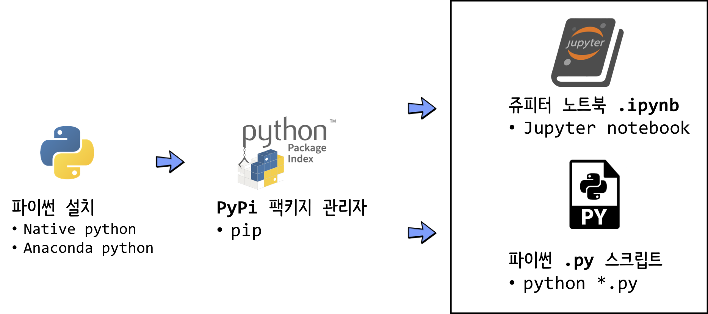

```{r setup, include=FALSE}
knitr::opts_chunk$set(echo = TRUE, message=FALSE, warning=FALSE,
                      comment="", digits = 3, tidy = FALSE, prompt = FALSE, fig.align = 'center')

library(reticulate)
use_condaenv("anaconda3")
# reticulate::repl_python()
```


# `iris` 예측모형 {#python-ml-modeling}

먼저 `iris` 품종 분류를 위한 예측모형을 개발해 본다. 이를 위한 작업흐름을 다음과 같이 잡아 실행한다.

- pandas
- sklearn
    - train_test_split
    - RandomForestClassifier
    - metrics

이를 통해 `iris` 예측모형의 분류 정확성, 즉 모형 성능을 파악할 수 있다.

```{python predictive-model}
import pandas as pd
from sklearn.model_selection import train_test_split
from sklearn.ensemble import RandomForestClassifier
from sklearn import metrics

## 데이터 가져오기
iris_df = pd.read_csv("data/iris_ws.csv")

## 데이터 전처리
iris_df.dropna(inplace=True)
X = iris_df.drop(columns=['variety'], axis=1)
y = iris_df['variety']

## 훈련/시험 데이터셋 분리
X_train, X_test, y_train, y_test = train_test_split(X, y, 
                          test_size=0.3, random_state=42)

## 예측모형 적합
model = RandomForestClassifier()
model.fit(X, y)

## 예측모형 성능
y_pred = model.predict(X_test)
print(metrics.accuracy_score(y_test, y_pred))
```

# `iris` 예측모형 배포 {#python-ml-deployemnt}

`iris` 품종분류 예측모형으로 Random Forest를 사용하여 모형 성능 예측력 100%를 달성하였다. 이를 배포해보자. 먼저 앞서 모형 개발에 사용된 코드에서 일부를 바꿔야 한다.
데이터를 가져와서 결측값 제거 등 작업을 수행하고 Random Forest 예측모형을 `data/` 디렉토리 `rf_model.pkl` 파일로 떨궈둔다.

```{python predictive-model-deploy}
# iris_rf.py 파일명으로 저장

import pandas as pd
from sklearn.ensemble import RandomForestClassifier
import pickle

## 데이터 가져오기
iris_df = pd.read_csv("data/iris_ws.csv")

## 데이터 전처리
iris_df.dropna(inplace=True)
X = iris_df.drop(columns=['variety'], axis=1)
y = iris_df['variety']

## 예측모형 적합
model = RandomForestClassifier()
model.fit(X, y)

## 예측모형 배포
iris_rf_model = 'data/rf_model.pkl'
with open(iris_rf_model, 'wb') as f:
    pickle.dump(model, f)
    
print(f"sucessfully deployed!!!")    
```

`ls -alh` 명령어로 `data/` 디렉토리 `rf_model.pkl` 파일을 확인한다.

```{bash predictive-model-deploy-check}
ls -alh data/rf_model.pkl
```


# `iris` 예측모형 배포 자동화 {#python-ml-deployemnt-auto}

`script` 디렉토리 `iris_rf.py` 파일명으로 저장시킨다. 그리고 나서 이를 `python` 명령어로 실행시킨다.

```{bash automate-ml-model-deployment}
python script/iris_rf.py
```


# 파이썬 작업흐름도 {#python-workflow}

파이썬을 통해 데이터 과학, 특히 앞서 개발한 예측모형 배포를 위한 자동화를 위해서 다음과 같은 작업흐름을 갖추게 된다.

1. 파이썬 설치
1. Pypi 팩키지 관리자 설치
1. 쥬피터 노트북으로 데이터 분석 및 예측모형 개발
1. `.py` 파이썬 스크립트로 작업 자동화

{#id .class width="100%"}

## 파이썬 설치 {#install-python}

파이썬은 [아나콘다](https://docs.anaconda.com/anaconda/install/) 혹은 [파이썬](https://www.python.org/downloads/)에서 설치하여 코딩을 하는 것이 일반적이다.

`which python` 명령어를 통해서 파이썬 버전을 확인한다.

```{bash check-python}
which python
```

## Pypi 팩키지 관리자 {#install-python-pip}

파이썬의 진정한 힘은 강력하고 다양한 파이썬 팩키지에서 나온다고 할 수 있다. 이를 손쉽게 설치할 수 있게 도와주는 것이 `Pypi` 팩키지 관리자다.

[Do I need to install pip?](https://pip.pypa.io/en/latest/installing/#do-i-need-to-install-pip)을 참조하여 [PyPi](https://pypi.org/project/pypi-install/)를 설치할 수 있다. 

- 우분투: `apt-get install python3-pip`
- 윈도우: `curl` 명령어로 `pip` 설치 파일을 가져와서 `python`으로 실행하여 설치한다.

```{r install-pip, eval=FALSE}
curl https://bootstrap.pypa.io/get-pip.py -o get-pip.py
python get-pip.py
```


## 파이썬과 `Pypi` 버전 매칭 {#install-python-pip-matching}

<div class = "row">
  <div class = "col-md-6">
**파이썬 버전**

```{bash python-pip-matching}
python --version
```

  </div>
  <div class = "col-md-6">
**`Pypi` 버전**

```{bash python-pip-matching-version}
pip --version
```

  </div>
</div>


## 파이썬 스크립트 실행 {#install-python-pip-matching-script}

```{bash python-script-run}
echo "print('데이터 사이언스가 미래다!!! \n')" > hello_ds.py

python hello_ds.py
```


