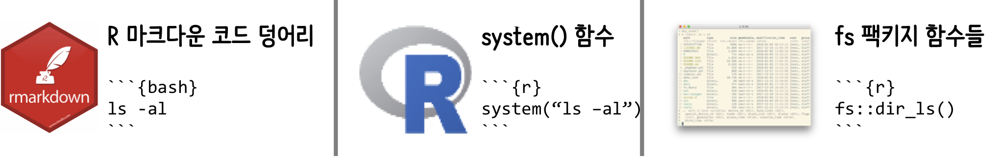

```{r, include=FALSE}
knitr::opts_chunk$set(echo = TRUE, message=FALSE, warning=FALSE,
                      comment="", digits = 3, tidy = FALSE, prompt = FALSE, fig.align = 'center')

library(tidyverse)
```

# 시스템 호출(System Call) {#call-go-for-it}

R 프로그램도 유닉스/리눅스 운영체제 입장에서 보면 수많은 프로그램 중 하나로 이를 묶어서 다양한 방식으로 호출하여 사용할 수 있다.
파일을 많이 다루는 경우 최근에 개발된 [`fs`](https://github.com/r-lib/fs) 팩키지를 사용하면 도움이 많이 된다.
R 마크다운 기반으로 작업을 수행하게 되는 경우 ```{bash} ... ``` 코드 덩어리를 사용하면 된다.
전통적으로는 `system`

{#id .class width="100%"}

## Rmd 코드 덩어리 {#call-rmd}

먼저 R 코드 덩어리에 아래와 같이 `r` 혹은 `python` 대신 `bash`로 지정하게 되면 쉘 명령어를 실행시킬 수 있다.

<pre><code>```{bash call-bash-from-rmd}
ls -al
```</code></pre>


```{bash call-bash-from-rmd}
ls -al | head
```

## `system()` 명령어 {#call-system}

`system()` 명령어를 사용해서 쉘 명령어를 함께 넣게 되면 실행이 가능한데, `intern=TRUE` 인자를 함께 넣어주어야 결과를 확인할 수 있다.

```{r call-system}
system("ls -al | head", intern=TRUE)
```

## `fs` 팩키지 {#fs-pkg-system}

`fs` 팩키지 `dir_ls()` 명령어를 사용하게 되면 R 명령어로 별도 다른 작업없이 쉘 명령어와 동일한 효과를 얻을 수 있다.
아래 표에 나와 있듯이 유닉스 쉘 명령어와 매칭되는 `fs` 팩키지 명령어를 찾아야 한다.

```{r fs-package-ls}
fs::dir_ls(recurse = TRUE, glob = "*.Rmd")
```

# `fs`, R 함수, 쉘 비교 [^fs-comp] {#shell-r-fs-comparison}

[^fs-comp]: [`libuv`에 기반을 둔 `fs` 팩키지](https://github.com/r-lib/fs)

`fs` 팩키지, R 함수(base), 쉘(shell) 명령어에 대한 사항이 [`fs` 팩키지 소품문](https://cloud.r-project.org/web/packages/fs/vignettes/function-comparisons.html)에 잘 나와 있다.

## 디렉토리 함수 {#shell-r-fs-directory}

| `fs`                               | R 함수(base)                                                            | 쉘(shell)                            |
| ---                                | ---                                                                     | ---                                  |
| `dir_ls("path")`                   | `list.files("path")`                                                    | `ls path`                            |
| `dir_info("path")`                 | `do.call(rbind, lapply(list.files("path"), file.info))`                 | `ls -al path`                        |
| `dir_copy("path", "new-path")`     | `dir.create("new-path"); file.copy("path", "new-path", recursive=TRUE)` | `cp path new-path`                   |
| `dir_create("path")`               | `dir.create("path")`                                                    | `mkdir path`                         |
| `dir_delete("path")`               | `unlink("path", recursive = TRUE)`                                      | `rm -rf path`                        |
| `dir_exists("path")`               | `dir.exists("path")`                                                    | `if [ -d "path" ]; then ... ; fi`    |
| ~~`dir_move()`~~ (see `file_move`) | `file.rename("path", "new-path")`                                       | `mv path new-path`                   |
| `dir_map("path", fun)`             | *No direct equivalent*                                                  | `for file in $(ls path); do ...; done` |
| `dir_tree("path")`                 | *No direct equivalent*                                                  | `tree path`                          |


## 파일 함수 {#shell-r-fs-file}

| `fs`                                        | R 함수(base)                      | 쉘(shell)                     |
| ---                                         | ---                               | ---                               |
| `file_chmod("path", "mode")`                | `Sys.chmod("path", "mode")`       | `chmod mode path`                 |
| `file_chown("path", "user_id", "group_id")` | *No direct equivalent*            | `chown options path `             |
| `file_copy("path", "new-path")`             | `file.copy("path", "new-path")`   | `cp path new-path`                |
| `file_create("new-path")`                   | `file.create("new-path")`         | `touch new-path`                  |
| `file_delete("path")`                       | `unlink("path")`                  | `rm path`                         |
| `file_exists("path")`                       | `file.exists("path")`             | `if [ -f "path" ]; then ... ; fi` |
| `file_info("path")`                         | `file.info("path")`               | `ls -al path`                     |
| `file_move("path", "new-path")`             | `file.rename("path", "new-path")` | `mv path new-path`                |
| `file_show("path")`                         | `browseURL("path")`               | `open path`                       |
| `file_touch()`                              | *No direct equivalent*            | `touch path`                      |
| `file_temp()`                               | `tempfile()`                      | `mktemp`                          |
| `file_test()`                               | *No direct equivalent*            | `if [ -d "path" ]; then ...; fi`  |

## 경로(path) 함수 {#shell-r-fs-path}

| `fs`                                                 | R 함수(base)                                      | 쉘(shell)                     |
| ---                                                  | ---                                               | ---                           |
| `path("top_dir", "nested_dir", "file", ext = "ext")` | `file.path("top_dir", "nested_dir", "file.ext")`  | `top_dir/nested_dir/file.ext` |
| `path_expand("~/path")`                              | `path.expand()`                                   | `realpath -m -s ~/path`       |
| `path_dir("path")`                                   | `dirname("path")`                                 | `dirname path`                |
| `path_file("path")`                                  | `basename("path")`                                | `basename path`               |
| `path_home()`                                        | `path.expand("~")`                                | `$HOME`                       |
| `path_package("pkgname", "dir", "file")`             | `system.file("dir", "file", package = "pkgname")` | *No direct equivalent*        |
| `path_norm("path")`                                  | `normalizePath()`                                 | `realpath`                    |
| `path_real("path")`                                  | `normalizePath(mustWork = TRUE)`                  | `realpath`                    |
| `path_rel("path/foo", "path/bar")`                   | *No direct equivalent*                            | *No direct equivalent*        |
| `path_common(c("path/foo", "path/bar", "path/baz"))` | *No direct equivalent*                            | *No direct equivalent*        |
| `path_ext_remove("path")`                            | `sub("\\.[a-zA-Z0-9]*$", "", "path")`             | *No direct equivalent*        |
| `path_ext_set("path", "new_ext")`                    | `sub("\\.[a-zA-Z0-9]*$", "new_ext", "path")`      | *No direct equivalent*        |
| `path_sanitize("path")`                              | *No direct equivalent*                            | *No direct equivalent*        |

# 작업 시나리오 {#rpa-시나리오}

웹브라우저를 띄워서 특정 화면을 캡쳐하고자 할 경우 웹브라우저를 다음과 같이 연다.

```{bash chrome}
# open -a "Google Chrome" https://www.facebook.com/groups/tidyverse
open -a "safari" https://www.facebook.com/groups/tidyverse
```

화면을 캡쳐하고자 할 경우 아래와 같이 화면을 `webshot` 팩키지를 사용해서 이미지로 저장시킨다.

```{r take-screenshot}
library(webshot)
webshot("https://www.facebook.com/groups/tidyverse", "fig/tidyverse_korea.png",
         cliprect = c(0, 0, 800, 600))
```


