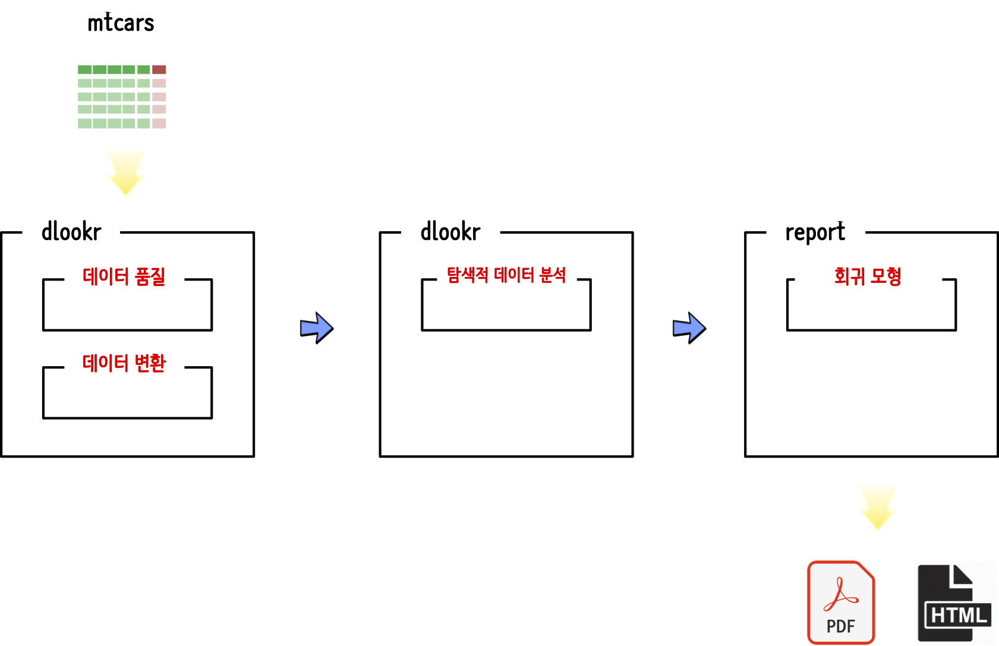

```{r, include=FALSE}
knitr::opts_chunk$set(echo = TRUE, message=FALSE, warning=FALSE,
                      comment="", digits = 3, tidy = FALSE, prompt = FALSE, fig.align = 'center')

library(tidyverse)
```

# `autoX` 작업흐름도 [^autoEDA-resources] {-#rpa-automation-workflow}

[^autoEDA-resources]: [A list of software and papers related to automatic and fast Exploratory Data Analysis](https://github.com/mstaniak/autoEDA-resources)

`ggplot2` 팩키지 내장된 [자동차 연비 데이터, `mpg`](https://ggplot2.tidyverse.org/reference/mpg.html)를 사용해서 데이터 품질과 탐색적 데이터 분석 및 회귀모형 보고서를 자동 생성하는 사례를 살펴본다.

- 데이터(Data): [`dlookr`](https://github.com/choonghyunryu/dlookr)
    - 데이터 품질: `dlookr::diagnose_report()`
    - 데이터 변환: `dlookr::transformation_report(target = ???)`
- 탐색적 데이터 분석(EDA): `dlookr::eda_report(target = ???)`    
- 모형: [`report`](https://github.com/easystats/report)
    - `report::report()`

<center>
{#id .class width="77%"}
</center>


# 데이터 변환 {#autoEDA-data-transform}

`ggplot2::mpg` 데이터에는 결측값이나 문제될 것은 특별히 없고 다만 문자형 변수가 있어 이를 범주형 변수로 변환하는 과정만 거치고 이를 `data` 디렉토리  `mpg_transform.pdf` 파일로 저장시킨다.

```{r data-quality, eval=FALSE}
library(tidyverse)
library(dlookr)

ggplot2::mpg %>% 
  mutate_if(is.character, factor) %>% 
  transformation_report(target =  hwy, output_format = "pdf", output_dir="data", output_file="mpg_transform.pdf")

```


# 데이터 변환 보고서 {#autoEDA-data-transform-report}

{#id .class width="100%" height=600}
