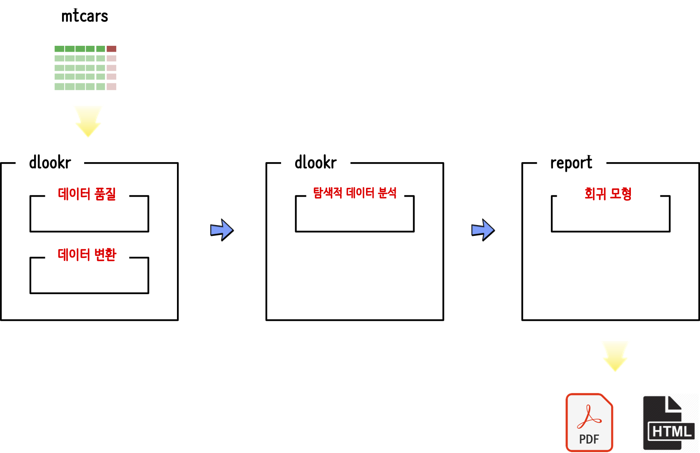

```{r, include=FALSE}
knitr::opts_chunk$set(echo = TRUE, message=FALSE, warning=FALSE,
                      comment="", digits = 3, tidy = FALSE, prompt = FALSE, fig.align = 'center')

library(tidyverse)
```

# `autoX` 작업흐름도 [^autoEDA-resources] {#rpa-automation-workflow}

[^autoEDA-resources]: [A list of software and papers related to automatic and fast Exploratory Data Analysis](https://github.com/mstaniak/autoEDA-resources)

`ggplot2` 팩키지 내장된 [자동차 연비 데이터, `mpg`](https://ggplot2.tidyverse.org/reference/mpg.html)를 사용해서 데이터 품질과 탐색적 데이터 분석 및 회귀모형 보고서를 자동 생성하는 사례를 살펴본다.

- 데이터(Data): [`dlookr`](https://github.com/choonghyunryu/dlookr)
    - 데이터 품질: `dlookr::diagnose_report()`
    - 데이터 변환: `dlookr::transformation_report(target = ???)`
- 탐색적 데이터 분석(EDA): `dlookr::eda_report(target = ???)`    
- 모형: [`report`](https://github.com/easystats/report)
    - `report::report()`

<center>
{#id .class width="77%"}
</center>

# 데이터 {#autoEDA-data}

데이터는 `ggplot2` 팩키지 내장된 [자동차 연비 데이터, `mpg`](https://ggplot2.tidyverse.org/reference/mpg.html)를 사용한다. 
`mpg` 데이터셋은 1999년부터 2008년까지 38개 차종에 대한 연비정보를 담고 있다.


## 데이터 품질 {#autoEDA-data-quality}

- [`autoX` 헬로월드: 데이터 품질](rpa-auto-X-hello-world-quality.html)
  
## 데이터 변환 {#autoEDA-data-transformation}

- [`autoX` 헬로월드: 데이터 변환](rpa-auto-X-hello-world-transform.html)

# 탐색적 데이터 분석 {#autoEDA-EDA}

- [`autoX` 헬로월드: EDA](rpa-auto-X-hello-world-EDA.html)        

# 모형 {#autoEDA-model}

- [`autoX` 헬로월드: 모형](rpa-auto-X-hello-world-model.html)        
