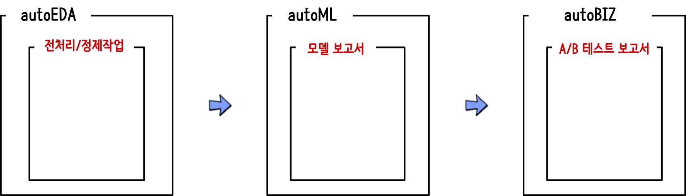

```{r, include=FALSE}
knitr::opts_chunk$set(echo = TRUE, message=FALSE, warning=FALSE,
                      comment="", digits = 3, tidy = FALSE, prompt = FALSE, fig.align = 'center')

library(tidyverse)
```

# `autoX` 자동화 [^autoEDA-paper] {#rpa-automation}

[^autoEDA-paper]: [Mateusz Staniak, Przemyslaw Biecek (18 Sep 2019), "The Landscape of R Packages for Automated Exploratory Data Analysis", arXiv.org](https://arxiv.org/abs/1904.02101)

탐색적 데이터 분석 자동화(`autoEDA`)는 기계학습모형(`autoML`) 자동화와 다른 모습이지만 결국 추구하는 바는 동일하다고 볼 수 있다. 이러한 거대한 흐름은 여기서 멈추지 않고 다음을 준비하는 큰 도움이 될 것이다.




# 데이터셋 [^visdat] [^csv-fingerprint] {#autoEDA-dataset}

[^visdat]: [Nicholas Tierney, "Preliminary Exploratory Visualisation of Data"](https://github.com/ropensci/visdat)

[^csv-fingerprint]: [Qualitative visualization of the data types of CSV files](https://github.com/setosa/csv-fingerprint)

# EDA {#autoEDA}


# autoML {#autoEDA-autoML}

# `autoAB` A/B 테스트 보고서 {#autoEDA-autoAB}

