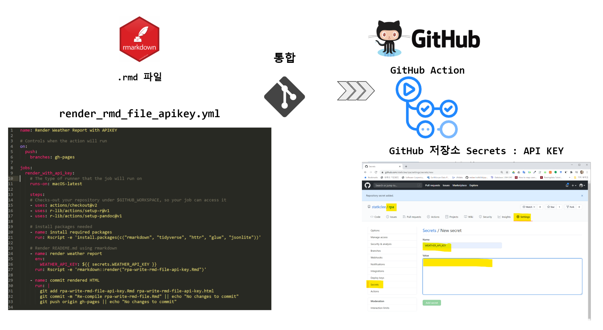
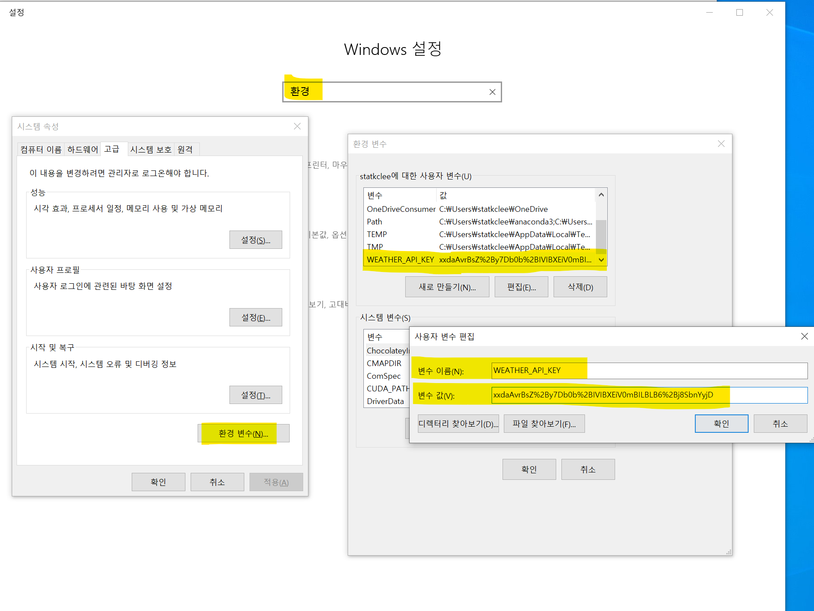
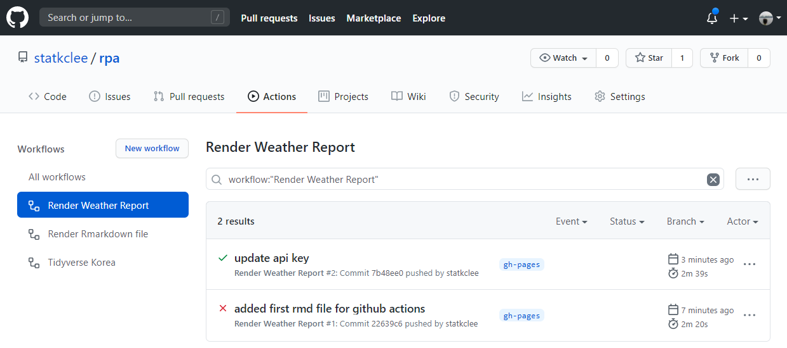
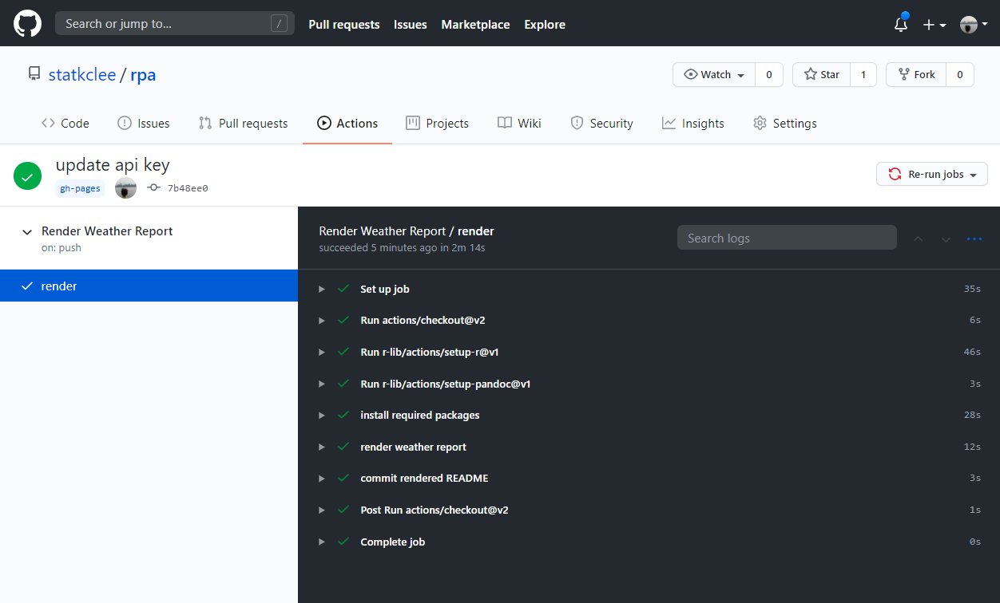
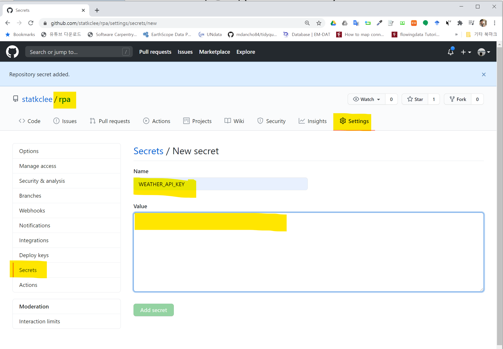

```{r, include=FALSE}
knitr::opts_chunk$set(echo = TRUE, message=FALSE, warning=FALSE,
                      comment="", digits = 3, tidy = FALSE, prompt = FALSE, fig.align = 'center')

library(tidyverse)
Sys.setlocale("LC_MESSAGES", "C")
```

# YAML & Secrets {#yaml-secrets}

더이상 로컬 컴퓨터에서 개발과 검증이 진행되지 않는다. 
GitHub에서 제공하는 컴퓨터에서 운영체제 설치하고 관련 환경 설정하고 개발한 앱을 올려 테스트하고 운영환경으로 넘기는 과정을 진행하는 것이다.
이를 위해서 환경변수(`env`)에 API 키를 숨기는 것이 필요하고 당연히 GitHub Actions 단계에서는 환경변수에 숨긴 API KEY값을 가져와서 후속작업을 진행하는 것이 무척 중요하다.



# 로컬 컴퓨터 환경변수 {#import-local-computer-env}

GitHub Actions에 들어가기 전에 로컬 컴퓨터에서 환경변수를 저장시키고 이를 R에서 불러 API KEY를 활용하는 방식을 먼저 검증한다.
로컬 컴퓨터에 `WEATHER_API_KEY` 변수명으로 KEY값을 저장시킨다. 
그리고 나서 `Sys.getenv("WEATHER_API_KEY")` 명령어와 같이 환경변수에 저장된 값을 가져온다.



API KEY를 환경변수로 숨긴 사항을 반영한 Rmd 파일은 다음과 같다.

```{r embed-Rmd-file}
xfun::embed_file('rpa-write-rmd-file-api-key.Rmd')
```


<div class = "row">
  <div class = "col-md-6">
**API KEY 그대로 노출 시킨 경우**

```{r rmd-api-key}
KMA_KEY <- "xxdaAvrBsZ%2By7Db0b%2BIVIBXEiV0mBILBLB6%2Bj8Sbn.........."
```


  </div>
  <div class = "col-md-6">
**API KEY를 환경변수로 숨긴 경우**

```{r rmd-api-key-env, eval = FALSE}
KMA_KEY <- Sys.getenv("WEATHER_API_KEY")
```

  </div>
</div>


# API KEY 노출된 개발 [^github-acitons-yml-usethis] {#write-yml-script}

## GitHub Actions YML 파일작성 [^github-acitons-yml-usethis] {#write-yml-script-write}

[^github-acitons-yml-usethis]: [By Gavin Simpson (30 April 2020), "Rendering your README with GitHub Actions", From the bottom of the heap the musings of a geographer](https://fromthebottomoftheheap.net/2020/04/30/rendering-your-readme-with-github-actions/)

`.github/workflows/` 디렉토리 밑에 `.github/workflows/render_rmd_file.yml` 와 같이 `render_rmd_file.yml` 파일에 `workflow`, `job`, `step`, `action` 사항을 작성한다.

- `workflow`: CI 도구가 실행시키는 작업흐름(workflow)
- `job`: 작업흐름은 작업(job)으로 구성되고 작업흐름 실행시 언급되는 작업을 의미함.
- `step`: 작업은 단계(step)으로 구성됨.
- `action`: 각 단계는 동작(action)으로 구성되어 가장 작은 실행 단위.

```{r write-yml, eval = FALSE}
name: Render Weather Report

# Controls when the action will run
on:
  push:
    branches: gh-pages

jobs:
  render:
    # The type of runner that the job will run on
    runs-on: macOS-latest

    steps:
    # Checks-out your repository under $GITHUB_WORKSPACE, so your job can access it
    - uses: actions/checkout@v2
    - uses: r-lib/actions/setup-r@v1
    - uses: r-lib/actions/setup-pandoc@v1

    # install packages needed
    - name: install required packages
      run: Rscript -e 'install.packages(c("rmarkdown", "tidyverse", "httr", "glue", "jsonlite"))'

    # Render READEME.md using rmarkdown
    - name: render weather report
      run: Rscript -e 'rmarkdown::render("rpa-write-rmd-file.Rmd")'

    - name: commit rendered HTML
      run: |
        git add rpa-write-rmd-file.Rmd rpa-write-rmd-file.html
        git commit -m "Re-compile rpa-write-rmd-file.Rmd" || echo "No changes to commit"
        git push origin gh-pages || echo "No changes to commit"
        
```


```{r embed-yml-file}
xfun::embed_file('.github/workflows/render_rmd_file.yml')
```


## GitHub Actions 서버 {#github-actions-server}

`YAML` 파일은 github에 `gh-pages` 브랜치에 `push` 동작이 일어날 때 발생된다. `render` 이름 아래 맥OS(`macOS-latest`) 운영체제에 R마크다운을 올리기 위한 기본적인 내용이 `steps:` 에서 처리된다. 먼저 날씨 보고서 Rmd 파일을 HTML 파일로 변환시키는데 필요한 R 팩키지를 설치한다. 그리고 나서 `rmarkdown::render()` 명령어로 HTML 변환작업을 실행시킨다. 마지막으로 HTML 파일으로 Github에 푸쉬하여 마무리한다.

```{r ghactions-trigger, eval = FALSE}
on:
  push:
    branches: gh-pages
```

<div class = "row">
  <div class = "col-md-6">
**GitHub Actions Workflows**



  </div>
  <div class = "col-md-6">
**GitHub Actions Workflows 상세내용**




  </div>
</div>

# API KEY 보안강화 {#write-yml-script-apikey}

## API KEY 등록 {#github-actions-api-key}

동네예보 보고서 Rmd 파일의 경우 공공데이터 포털에서 발급받은 API 키가 그대로 노출되어 있다. 
이를 별도 과정을 거쳐 숨겨놔야 보안을 높일 수 있다. 이를 위해서 GitHub 저장소에서 `Settings`를 클릭하게 되면 `Secrets`에 **New secret**를 통해서 API KEY를 등록시킬 수 있다.




## GitHub Actions YML 파일작성 [^github-acitons-yml-docs] {#write-yml-script-api}

[^github-acitons-yml-docs]: [GitHub Docs, "Using variables and secrets in a workflow"](https://docs.github.com/en/actions/configuring-and-managing-workflows/using-variables-and-secrets-in-a-workflow)

GitHub 저장소에서 `Settings`를 클릭해서 `Secrets` 탭에서 **New secret**를 통해서 등록된 API KEY를 YAML 파일에서 불러온다.
GitHub Docs에 정의된 방식을 따라 환경변수 `env`에 `WEATHER_API_KEY: ${{ secrets.WEATHER_API_KEY }}` 작성해서 실행과정에서 환경변수를 참조하여 정상작업이 될 수 있도록 준비한다.

```{r yaml-api, eval = FALSE}
jobs:
  render_with_api_key:
    # The type of runner that the job will run on
    runs-on: macOS-latest

    steps:
    # Checks-out your repository under $GITHUB_WORKSPACE, so your job can access it
    - uses: actions/checkout@v2
    - uses: r-lib/actions/setup-r@v1
    - uses: r-lib/actions/setup-pandoc@v1

    # install packages needed
    - name: install required packages
      run: Rscript -e 'install.packages(c("rmarkdown", "tidyverse", "httr", "glue", "jsonlite"))'

    # Render READEME.md using rmarkdown
    - name: render weather report
      env:
        WEATHER_API_KEY: ${{ secrets.WEATHER_API_KEY }}
      run: Rscript -e 'rmarkdown::render("rpa-write-rmd-file-api-key.Rmd")'
```

- [**실행결과**](https://github.com/statkclee/rpa/runs/1107739156?check_suite_focus=true)

```{r embed-yml-file-without-api}
xfun::embed_file('.github/workflows/render_rmd_file_apikey.yml')
```

## Rmd 파일 {#rmarkdown-with-apikeys-impact}

API KEY를 시스템 환경변수로 숨겼기 때문에 Rmd 파일에 API KEY를 반영한 코드도 이를 반영하여 숨긴다.

<div class = "row">
  <div class = "col-md-6">
**API KEY 그대로 노출 시킨 경우**

```{r rmd-api-key-down}
KMA_KEY <- "xxdaAvrBsZ%2By7Db0b%2BIVIBXEiV0mBILBLB6%2Bj8Sbn.........."
```


  </div>
  <div class = "col-md-6">
**API KEY를 환경변수로 숨긴 경우**

```{r rmd-api-key-env-down, eval = FALSE}
KMA_KEY <- Sys.getenv("WEATHER_API_KEY")
```

  </div>
</div>

한줄 변경한 상세 코드는 다음을 참조한다.

```{r embed-rmd-file-without-api}
xfun::embed_file('rpa-write-rmd-file-api-key.Rmd')
```
