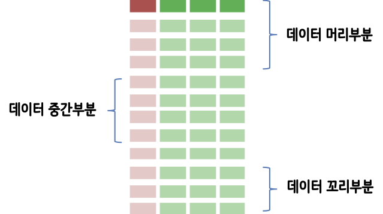

```{r setup, include=FALSE}
knitr::opts_chunk$set(echo = TRUE, message=FALSE, warning=FALSE,
                      comment="", digits = 3, tidy = FALSE, prompt = FALSE, fig.align = 'center')

library(reticulate)
use_condaenv("anaconda3")
# reticulate::repl_python()
```

# 데이터 다루기 {#data-munging}

대용량 텍스트 데이터를 다룰 경우 다양한 작업이 수반되는데 가장 많이 사용되는 작업은 다음과 같다.
이를 위해서 다양한 도구가 개발되어 있는데 `awk`, `sed`가 여기에 포함된다.

- 행을 필터링하여 추출

# 고정된 행을 추출 {#data-munging-filtering}

## 텍스트 데이터 준비 {#data-munging-filtering-rows}

`seq` 명령어를 활용해서 10줄로 구성된 데이터를 준비한다. 이를 통해서 `data/lines.txt` 파일에 작업준비를 한다.

```{bash text-filtering-rows}
seq -f "행번호: %g" 10
seq -f "행번호: %g" 10 > data/lines.txt
```

## 필터링 {#data-munging-filtering-rows}

앞서 데이터가 준비되면 아마도 가장 먼저 데이터를 살펴보기 위해서 데이터의 머리부분, 데이터의 꼬리부분 경우에 따라서는 중간부분을 필터링하고자 하는 경우가 많다. 이를 위해서 `head`, `tail`, `awk`, `sed` 명령어를 사용해서 원하는 바를 달성할 수 있다.



먼저 데이터의 머리부분을 가져오는 코드는 다음과 같다.

```{bash filtering-rows-head}
head -n 3 data/lines.txt
sed -n '1,3p' data/lines.txt
awk 'NR<=3' data/lines.txt
```

데이터의 마지막을 보려고 하면 `tail`을 사용한다.

```{bash text-filtering-rows-tail}
tail -n 3 data/lines.txt
```

데이터 중간을 뽑아내려고 하면 `head`, `tail`을 조합해서 사용하거나 `awk` 부울 연산자를 조합해서 사용할 수 있다.

```{bash text-filtering-rows-middle}
head -n 5 data/lines.txt | tail -n 2
```

```{bash text-filtering-rows-middle2}
awk '(NR>=4)&&(NR<=5)' data/lines.txt
```


## 패턴으로 필터링 {#data-munging-filtering-rows-pattern}

`grep` 도구를 사용해서 패턴을 지정하고 패턴에 맞는 행만을 추출하는 것도 많이 사용된다.
예를 들어 `grep`에 `-i` 인자를 넣어 대소문자 구분없이 `chapter`가 포함된 행을 추출한다. 너무 많아 파이프를 뒤에 두고 앞에서 4줄만 추출한다.

```{bash grep-pattern-filtering}
grep -i chapter data/finn.txt | head -n 5
```

앞서 `grep`에 정규표현식으로 패턴을 지정한다는 것을 명세하는 경우 `-E` 옵션으로 그다음 정규표현식을 작성하여 해당 패턴에 해당되는 행만 추출한다. '^CHAPTER (.*)\. The' 정규표현식은 CHAPTER로 시작하는 모든 행이 되는데 중간에 무엇이든 상관없고 The가 꼭 포함되어야만 된다.

```{bash grep-pattern-filtering-regex}
grep -E '^CHAPTER (.*)\. The' data/finn.txt
```

## 행 임의 추출 (random sampling) {#data-munging-filtering-rows-rs}

파일에서 임의추출하는 자세한 사항은 [xwMOOC 기계학습 - "대용량 데이터 표본추출"](https://statkclee.github.io/ml/ml-random-sampling.html)을 참조한다.
`shuf`가 가장 성능이 좋다고 알려져 있어 맥에서 `gshuf` 명령어를 사용해서 임의로 3줄을 추출한다.

```{bash grep-pattern-filtering-random}
gshuf -n 3 data/lines.txt 
```


# 값을 추출 {#data-munging-extract-values}

텍스트 데이터의 `grep`을 사용해서 패턴과 매칭되는 행을 추출하고 `cut`, `awk` 등 도구를 사용해서 해당 값을 추출하고 `csvlook`같은 도구를 사용해서 예쁘게 출력한다. 외관을 보기 좋게 치장하는데 `pip install csvkit` 명령어를 동원해서 `csvkit` 도구를 설치한다.

```{bash extract-values}
cat data/finn.txt | 
  tr '[:upper:]' '[:lower:]' | 
  grep -oE '\w{2,}' |
  grep -E '^a.*e$' | 
  sort | 
  uniq -c | 
  sort -nr |
  awk '{print $2","$1}' | 
#  header -a word, count | 
  head | 
  csvlook
```


# 찾아서 값 바꾸기 {#data-find-replace}

가장 단순하게 `tr` 명령어를 사용해서 문자를 교체하는 방법을 사용한다.
즉 단순하게 `tr` (translate) 명령어로 '철수'를 '길동'으로 교체한다.

```{bash name-translate-characters}
echo '안녕하세요. 철수씨' | tr '철수' '길동'
```

하지만, 문자 단위가 아니라 워드 단위나, 아스키 문자가 아닌 경우 다른 문자로 치환을 할 때 문제가 발생되니 이런 경우 `sed` 혹은  `awk`를 사용한다.

- `sed 's/regexp/replacement/g'` 명령어는 `regexp` 단어를 `replacement` 단어로 치환한다.

예를 들어 `John`을 `김상중`으로 대체할 경우 다음과 같이 `sed`를 구성한다.

```{bash name-translate-characters-john}
cat data/names.csv | sed 's/John/김상중/g'
```


# 직사각형 데이터 다루기 {#data-munging-rectangular}

직사각형 데이터를 다루기 위해서 예제 CSV 파일을 하나 준비한다.

```{bash names-data}
cat data/names.csv
```

CSV파일을 넣어 `-d` 구분자(delimiter)로 `,`를 지정하고, 쪼개진 칼럼의 2번째와 4번째 칼럼을 추출한다.

```{bash names-data-cut}
cat data/names.csv | cut -d , -f2,4
```

## 구분자 `awk` 칼럼 뽑아내기 {#data-munging-rectangular-awk}

`data/names.csv` 파일은 콤마구분자를 갖는다. 따라서 `-F ,`로 구분자를 지정해 두고 '{ print $3}'을 통해 즉, 3번째 칼럼만 추출한다.

```{bash column-extraction-awk}
awk -F , '{ print $3}' data/names.csv
```

## 정규표현식 + `awk` 칼럼 뽑아내기 {#data-munging-rectangular-awk-regex}

정규표현식을 `awk`에 넣어 칼럼 중 매칭되는 행만 추출할 수 있다.
즉 3번째 칼럼(`$3`)이 정규표현식 대문자 J로 시작되는 단어(`/^J/`)를 매칭하고 2번째 3번째 칼럼을 보기 좋게 조합시켜 `{ print $2 " : " $3}` 형태로 출력시킨다.

```{bash column-extraction-awk-regex}
awk -F , '$3 ~ /^J/ { print $2 " : " $3}' data/names.csv
```
