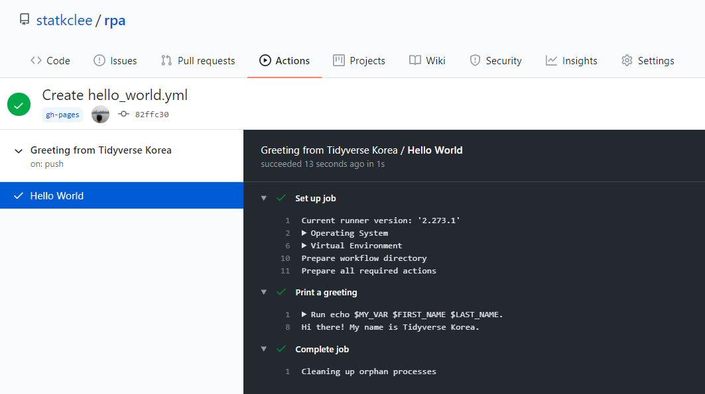

```{r, include=FALSE}
knitr::opts_chunk$set(echo = TRUE, message=FALSE, warning=FALSE,
                      comment="", digits = 3, tidy = FALSE, prompt = FALSE, fig.align = 'center')

library(tidyverse)
Sys.setlocale("LC_MESSAGES", "C")
```

# 헬로 월드 [^github-tutorial] {#hello-world-github-action}

[^github-tutorial]: [sonic0002 (2019-12-23 05:33:39), "A tutorial on Github Actions"](https://www.pixelstech.net/article/1577096152-A-tutorial-on-Github-Actions)

**GitHub Action** 은 작업흐름(workflow)으로 정의되며 작업흐름은 작업(job)으로 구성되고 다시 작업은 실행 단계(step)로 구성되고 각 단계는 동작(action)으로 최종 실행된다.

- `workflow`: CI 도구가 실행시키는 작업흐름(workflow)
- `job`: 작업흐름은 작업(job)으로 구성되고 작업흐름 실행시 언급되는 작업을 의미함.
- `step`: 작업은 단계(step)으로 구성됨.
- `action`: 각 단계는 동작(action)으로 구성되어 가장 작은 실행 단위.


## 배쉬 예제 {#local-bash-example}

한글 윈도우10 컴퓨터에서 배쉬를 돌린다는 것은 여러가지 설정을 해줘야 되서 다음과 같은 문제가 생긴다. 

```{bash echo-variable, eval = TRUE, error = TRUE}
MY_VAR="Hi there! My name is"
FIRST_NAME="Tidyverse"
LAST_NAME="Korea"
echo $MY_VAR $FIRST_NAME $LAST_NAME.
```


## GitHub Action {#local-bash-github-action}

로컬 컴퓨터에서 상기와 같이 작성한 배쉬 스크립트, 즉 리눅스 환경을 빌려 테스트를 진행하면 참 좋을 것이라고 생각된다.

상단 **Acitions** 메뉴에서 `new workflow`를 클릭하면 `hello_world.yml` 파일에 `workflow` 작업내용을 상세하게 작성할 수 있다.

- 리눅스 계열: ubuntu-latest，ubuntu-18.04 or ubuntu-16.04
- 윈도우 계열: windows-latest，windows-2019 or windows-2016
- 맥OS 계열: macOS-latest or macOS-10.14

```{r hello-world-yaml, eval = FALSE}
name: Greeting from Tidyverse Korea
on: push

jobs:
  my-job:
    name: Hello World
    runs-on: ubuntu-latest
    steps:
    - name: Print a greeting
      env:
        MY_VAR: Hi there! My name is
        FIRST_NAME: Tidyverse
        LAST_NAME: Korea
      run: |
        echo $MY_VAR $FIRST_NAME $LAST_NAME.
```

상기 GitHub Actions `yaml` 파일을 실행시키게 되면 다음과 같은 결과를 얻게 된다. 즉, 리눅스 환경에서 작성한 배쉬 헬로월드 스크립트를 정상적으로 실행기킬 수 있게 된다. 




