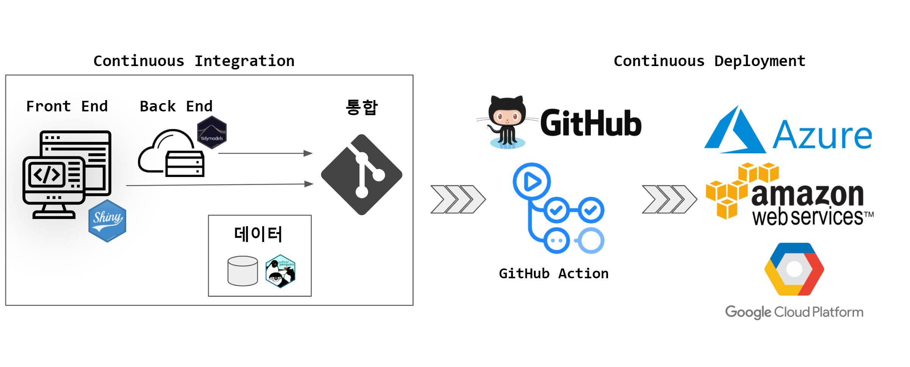

```{r, include=FALSE}
knitr::opts_chunk$set(echo = TRUE, message=FALSE, warning=FALSE,
                      comment="", digits = 3, tidy = FALSE, prompt = FALSE, fig.align = 'center')

library(tidyverse)
```



# FE / BE {#front-end-backend}

[Penguins Predictive Model - Shiny](https://github.com/statkclee/shiny_penguins) 저장소를 예로 들어 CI/CD 파이프라인을 만들어보자.

