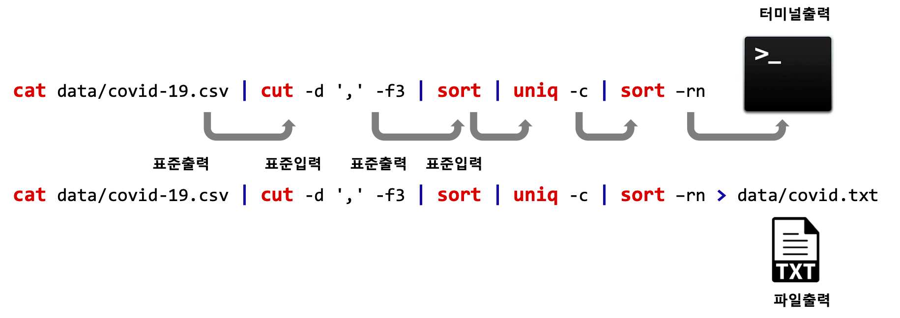

```{r, include=FALSE}
knitr::opts_chunk$set(echo = TRUE, message=FALSE, warning=FALSE,
                      comment="", digits = 3, tidy = FALSE, prompt = FALSE, fig.align = 'center')

library(tidyverse)
```

# 배쉬 쉘(Bash Shell) {#bash-intro}

배쉬(Bash)는 **B**ourne **A**gain **Sh**ell 의 약어로 80년대 제작되었지만, 클라우드 시대를 맞이하여 다시 각광받고 있으며 데이터 파이프라인 구축, 기계학습 모형을 실행하는데 꼭 필요한 도구다.

> "Control + Enter"키를 조합시켜면 편집기 코드를 콘솔화면으로 보내는 반면 "Control + Alt + Enter"키를 조합시켜면 편집기 코드가 터미널로 날아간다. 즉, R 코드 실행은 "Control + Enter", 배쉬쉘 실행은 "Control + Alt + Enter".

`grep` 명령어로 `soccer_scores.csv` 파일에서 `Etar`가 포함된 행을 뽑아 내서 앞에 3개만 골라 화면에 출력시킨다.

```{bash test}
grep 'Etar' data/shell/soccer_scores.csv | head -n 3
```

년도별로 골을 넣어 언급된 선수를 세어보자. 
이를 위해서 `.csv` 확장자로 끝나는 파일을 `cut` 명령어로 짤라 선수만 추려 놓고 정렬시킨 후에 `uniq -c` 명령어로 세어본다. 마지막으로 `sort -rn`으로 첫번째 칼럼을 숫자로 지정하고 역순으로 정렬시켜 결과를 출력한다.

```{bash test-fruit}
cat data/shell/soccer_scores.csv | cut -d ',' -f2 | sort | uniq -c | sort -rn
```

# 배쉬 스크립트(Bash Script) {#bash-intro-script}

`$` 쉘 프롬프트에 배쉬 명령어를 한줄 한줄 작성하는 것도 좋은데 이런 경우 매번 수작업으로 일일이 때려줘야 되기 때문에 이를 스크립트 파일로 작성할 경우 편리한 경우가 많다. 이를 위해서 몇가지 사전 정지 작업이 필요하다.

## 헬로 월드 스크립트 {#hello-world-bash-script}

배쉬 스크립트를 실행시킬 프로그램을 확인해야 한다. 
`which bash` 명령어로 배쉬 스크립트를 실행시킬 `bash` 경로명을 확인한다.

```{bash hello-bash}
which bash
```

배쉬 스크립트는 가장 먼저 앞서 확인한 `bash` 위치와 함께 쉬뱅(`#!`)으로 시작된다.
전형적인 배쉬 스크립트는 다음과 같다.

```{r bash-script-example, eval = FALSE}
#!/bin/bash 

echo '배쉬 스크립트 세계로 오신 것을 환영합니다'
```

상기 파일을 `hello_world.sh`와 같은 평문 텍스트 파일로 저장시키고 나서 `bash` 명령어로 실행시킨다.


<div class = "row">
  <div class = "col-md-6">
**배쉬 스크립트 내용**

```{bash show-bash-script}
cat code/hello_world.sh
```

  </div>
  <div class = "col-md-6">
**배쉬 스크립트 샐행**

```{bash show-bash-script-run}
bash code/hello_world.sh
```

  </div>
</div>

## 빈도수 계산 {#calculate-frequency}

대부분의 통계는 사실상 빈도수를 계산하는 것부터 시작하고 이것으로 분석이 마무리 되는 경우도 허다하다.
코로나19가 맹위를 떨치고 있는 현재 "2020-03-07" 예제 데이터로 살펴보자.

```{bash show-data}
cat data/covid-19.csv
```

<div class = "row">
  <div class = "col-md-6">
**`dplyr` 빈도수 세는 함수 사용**

```{r calculate-frequency-dply}
library(tidyverse)
covid_df <- readr::read_csv("data/covid-19.csv", col_names = FALSE)
covid_df %>% 
  count(X3, sort=TRUE)
```

  </div>
  <div class = "col-md-6">
**배쉬 명령어 파이프 연결**

```{bash calculate-frequency-bash}
cat data/covid-19.csv | cut -d ',' -f3 | sort | uniq -c | sort -rn
```

  </div>
</div>

이제 상기 파이프로 쭉 연결된 배쉬 명령어를 가독성이 좋게 스크립트로 정리하여 실행해 보자.
암호같은 배쉬 쉘스크립트에 주석을 붙여 가독성을 높인다.

```{bash write-script}
cat code/covid_country.sh
echo "====================="
bash code/covid_country.sh
```

# 핵심 개념 {#bash-script-concept}

유닉스 철학 중 하나가 하나만 잘하는 똘똘이들을 파이프로 묶어서 엄청난 작업을 하자는 것이다. 이 개념은 `tidyverse` 곳곳에서 찾을 수 있고, 최근에 `tidymodels`도 이런 사상을 뚜렷이 구현하고 있다.

- [추상화와 유닉스 그리고 파이프라인](https://statkclee.github.io/rpa/r-parallel-rscript-unix.html)
- [명령라인(Commandline) 데이터 분석](https://statkclee.github.io/rpa/cli-data-science-workflow.html)

## 파이프 {#pipe-redirection}

유닉스에서 데이터를 처리한 결과물은 표준 출력이 되고 이는 파이프를 통해 다시 다음 연산의 표준 입력으로 연결된다. 특별한 조치가 없으면 최종 결과물은 터미널에 보내지고 파일로 저장시키려면 리다이렉션(`redirection`)을 사용해서 파일로 저장시킨다.

- 표준 입력(STDIN, standard input): 프로그램 입력되는 일련의 데이터.
- 표준 출력(STDOUT, standard output): 프로그램에서 출력되는 일련의 데이터
- 표준 오류(STDERR, standard error): 프로그램 오류




## 인자(ARGV) {#bash-argv}

배쉬 스크립트는 인자(argument, parameter)를 받을 수 있는데 쉘 실행 호출 명령어 다음에 공백으로 구분을 하여 인자를 넘긴다.

- `$1`, `$2`, `$3`... 이와 같이 배쉬 스크립트에 전달되는 인자를 인식하고, 
- `$@` 혹은 `$*`으로 전달된 인자를 저장하고,
- `$#` 으로 총 전달인자갯수를 파악한다.

<div class = "row">
  <div class = "col-md-6">
**인자를 받는 배쉬 스크립트**

```{bash call-bash-script-with-argv-script}
cat code/covid_argv.sh
```

  </div>
  <div class = "col-md-6">
**인자를 받는 배쉬 스크립트 실행**

```{bash call-bash-script-with-argv}
bash code/covid_argv.sh 한국 중국 일본
```

  </div>
</div>

# 변수 {#bash-variable}

다른 R, 파이썬과 같은 언어와 마찬가지로 배쉬 스크립트에서 변수(variable)를 지정할 수 있다.
변수명과 변수값은 `=`으로 지정되며 공백이 없어야만 된다. 공백이 있는 경우 에러가 발생된다.
그리고 변수값을 참조하고자 할 경우 변수명 앞에 `$`기호를 붙이면 된다.

예를 들어, 국가변수(`country`)를 선언하고 값으로 `한국`을 집어넣고,
동일하게 발병자수(`infected`)로 10을 할당하여 이를 화면에 출력하는 스크립트를 다음과 같이 작성할 수 있다.

<div class = "row">
  <div class = "col-md-6">
**변수 선언 참조 배쉬 스크립트**

```{bash variable-assign}
cat code/covid_variable.sh
```

  </div>
  <div class = "col-md-6">
**변수 선언 참조 배쉬 스크립트 실행**

```{bash variable-assign-run}
bash code/covid_variable.sh
```

  </div>
</div>

## 쉘 in 쉘 {#bash-shell-in-shell}

쉘 내부에 쉡(Shell in Shell) 명령어를 실행시킬 수 있다. 이를 위해서 별도 구문을 익혀야 하는데... 크게 두가지 표기법이 있지만 하는 역할은 동일하다. 두가지 표기법 중 `$()` 표기법이 선호된다.

- `$()` 표기법: `$(쉘 명령어)`
- `` 표기법: 쉘 명령어를 백틱 사이에 넣는다.

<div class = "row">
  <div class = "col-md-6">
**쉘in쉘 배쉬 스크립트**

```{bash shell-in-shell}
cat code/covid_shell_in_shell.sh
```

  </div>
  <div class = "col-md-6">
**쉘in쉘 배쉬 스크립트 실행**

```{bash shell-in-shell-run}
bash code/covid_shell_in_shell.sh
```

  </div>
</div>

# 배쉬 계산기 {#bash-calculator}

배쉬를 전자계산기처럼 사용하려면 `expr` 표현식을 사용하면 되지만 실수를 계산하지 못하는 약점이 있다.
배쉬 사칙연산은 `expr`로 가능한데 두가지 주의할 점이 있다.

1. 곱셈을 할 경우: $\times$ 곱셈기호는 `*`인데 쉘에서 `*`은 모든 파일을 의미하기 때문에 앞에 역스래쉬를 붙여 `\*`로 표기한다.
1. 나눗셈: 다행히 정수로 떨어지면 상관없지만, 나머지가 생기게 되면 뒤쪽 나머지를 짤라먹는다.

<div class = "row">
  <div class = "col-md-6">
**계산기 배쉬 스크립트**

```{bash bash-calculator}
cat code/covid_calculator.sh
```

  </div>
  <div class = "col-md-6">
**계산기 배쉬 스크립트 실행**

```{bash bash-calculator-run}
bash code/covid_calculator.sh
```

  </div>
</div>

소수점을 계산하는 배쉬 스크립트를 작성하기 위해서 `bc`라는 프로그램을 사용한다. 
하지만, `scale=2;`를 붙여줘야 원하는 결과를 얻을 수 있다.

<div class = "row">
  <div class = "col-md-6">
**`bc` 계산기 배쉬 스크립트**

```{bash bash-bc}
cat code/covid_calculator_bc.sh
```

  </div>
  <div class = "col-md-6">
**`bc` 계산기 배쉬 스크립트 실행**

```{bash bash-bc-run}
bash code/covid_calculator_bc.sh
```

  </div>
</div>

## 기술 통계량 {#bash-calculator-descriptive-statistics}

계산을 할 수 있으니 이제 합계와 평균을 계산하는 예제를 만들어보자.
코로나19 발병관련 자주 언급되는 국가 5개를 뽑아 확진자수를 국가별로 넣어둔다.
쉘인쉘을 이용하여 국가별 발병자를 더하는데 `bc`를 사용한다.
동일한 방법으로 국가별 평균값도 계산한다.

<div class = "row">
  <div class = "col-md-6">
**기술통계 배쉬 스크립트**

```{bash bc-descriptive-statistics}
cat code/covid_descriptive.sh
```

  </div>
  <div class = "col-md-6">
**기술통계 배쉬 스크립트 실행**

```{bash bc-descriptive-statistics-run}
bash code/covid_descriptive.sh
```

  </div>
</div>

# 자료구조 {#shell-data-structure}

데이터 과학과 연관된 쉘 자료구조로 배열(array)과 연관 배열(associative array)이 기본 자료구조로 들 수 있다.

## 배열 {#shell-array}

쉘에서 배열은 스칼라 값을 담고 있는 용기로 `R`에서는 벡터(vector), 
파이썬에서는 리스트(list)로 불린다.

|   언어  |   명칭       | 
|---------|--------------|
|  `R`    | 벡터(vector) |
| 파이썬  | 리스트(list) |
|   쉘    | 배열(array)  |


코로나 발병 국가명을 배열(`COUNTRY`)로 정의하여 넣고, `${COUNTRY[@]}` 와 같이 참조하고 
`@`을 통해 전체 배열 원소를 뽑아낸다. `#`은 앞서와 같이 배열 길이를 뽑아내고자 할 때 사용한다.

<div class = "row">
  <div class = "col-md-6">
**배열 배쉬 스크립트**

```{bash array-notation}
cat code/covid_array.sh
```

  </div>
  <div class = "col-md-6">
**배열 배쉬 스크립트 실행**

```{bash array-notation-run}
bash code/covid_array.sh
```

  </div>
</div>


## 연관 배열 ($\times$) {#shell-associative-array}

두번째 연관 배열(associative array)는 `R`에서는 리스트(named list), 파이썬에서는 사전(dictionary)로 불리지만 동일한 개념을 갖고 있다.

|   언어  |   명칭       | 
|---------|--------------|
|  `R`    | 리스트(named list)   |
| 파이썬  | 사전(dictionary) |
|   쉘    | 연관 배열(associative array)  |

<div class = "row">
  <div class = "col-md-6">
**연관 배열 배쉬 스크립트**

```{bash associative-array}
cat code/covid_associative_array.sh
```

  </div>
  <div class = "col-md-6">
**연관 배열 배쉬 스크립트 실행**

```{bash associative-array-run}
bash code/covid_associative_array.sh
```

  </div>
</div>

# 반복문(`for`) {#shell-for}


# 조건문(`if`) {#shell-if}

# 함수 {#shell-function}

# 자동실행(`cron`) {#shell-cron}


